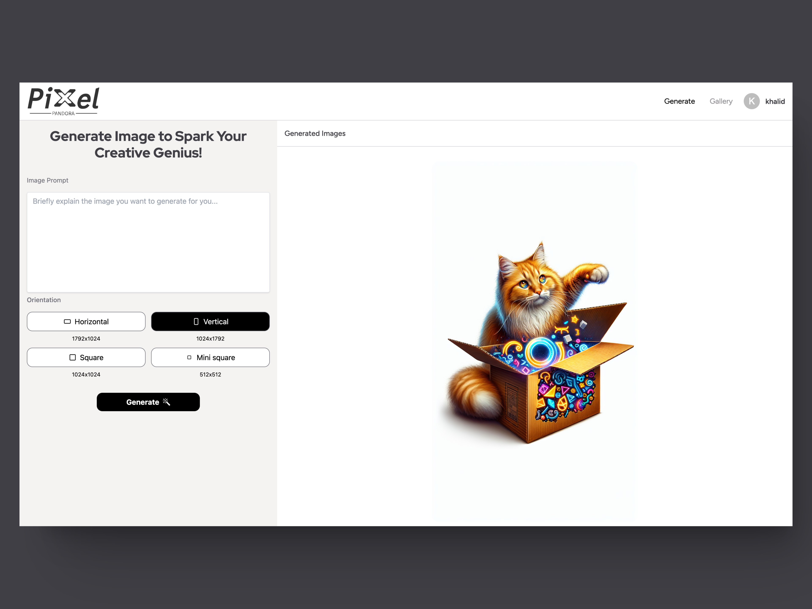
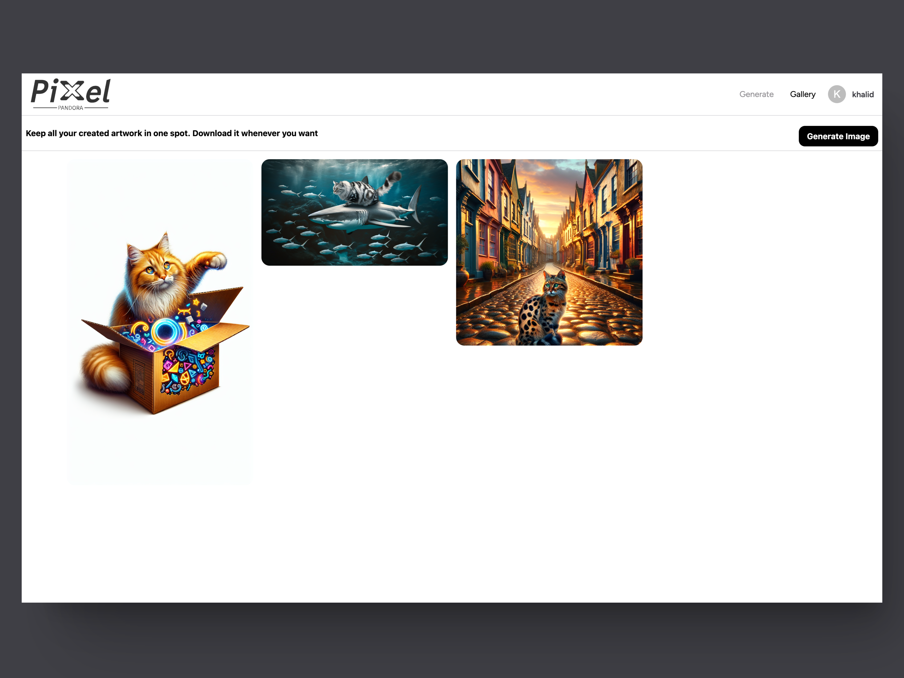
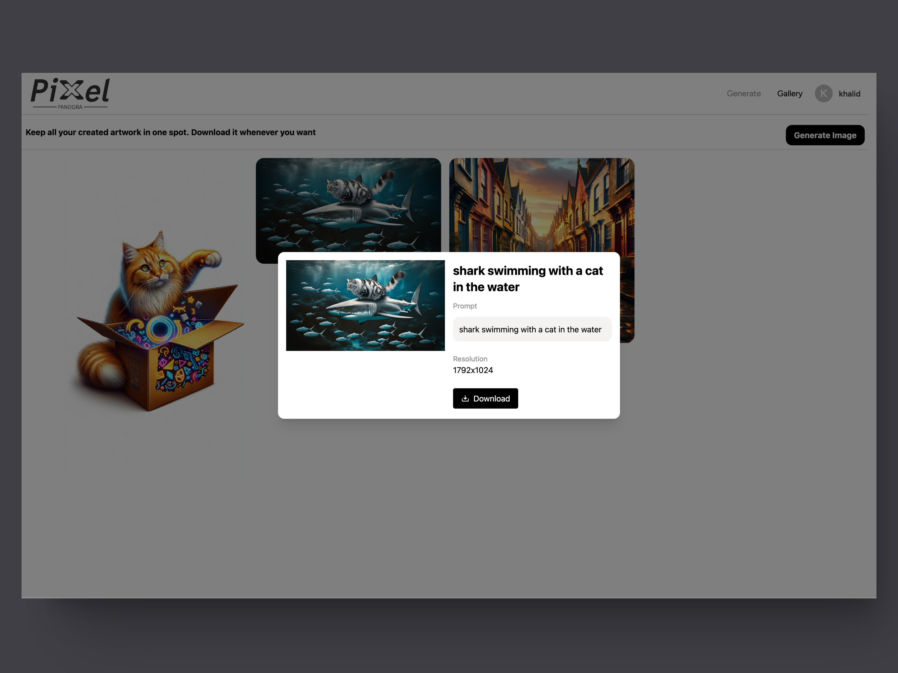

# Pixel-Pandora: Full-Stack AI Image Generation

## Project Overview

Pixel-Pandora is a full-stack web application created to improve my learning of full-stack development using the MERN stack, TypeScript, and integrating Docker to learn about containerization and its benefits in both development and deployment environments

This project allows users to generate and manage high-quality AI-generated images with the help of OpenAI's DALL-E models

## Preview





## Features

- AI-powered image generation using OpenAI's DALL-E models
- Text-to-image and image-to-image transformations
- User authentication and secure session management
- High-quality image downloads
- Integration with Cloudinary for image storage
- React-based frontend with dynamic components

## Installation

### Prerequisites

Ensure you have the following installed:

- Node.js and npm
- MongoDB
- Docker (optional, for containerized development and deployment)

## Setup

1. **Clone the repository**:

   ```bash
   git clone https://github.com/khalid-nur/pixel-pandora.git
   cd pixel-pandora

   ```

2. **Install backend dependencies**:

   ```bash
   cd server
   npm install

   ```

3. **Install frontend dependencies:**
   ```bash
   cd client
   npm install
   ```

### **Using Docker**

To run the application using Docker:

- Make sure you have Docker installed

- Navigate to the root directory which contains the `docker-compose.yml` file

- Run the following command:

  ```bash
  sudo docker compose up

  ```

- The application will be available at `http://localhost:5173`

For development purposes to monitor the files for changes automatically use the command:

```bash
sudo docker compose watch
```
